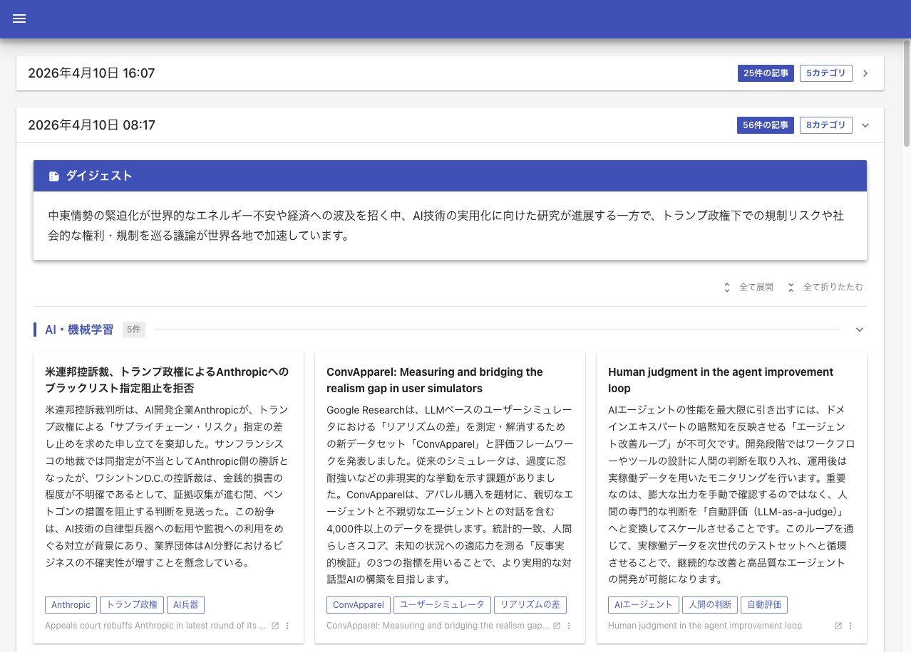

# News Viewer

AI が収集・要約したニュース記事を閲覧するための Web アプリケーション。
バッチごとに蓄積されたニュース要約を、カテゴリ別カード一覧とダイジェストとして表示します。



## 技術スタック

- **フレームワーク**: Next.js 16 (App Router, Standalone output)
- **UI**: MUI v9 (Material Design) + Emotion
- **ORM**: Prisma 7 + better-sqlite3
- **DB**: SQLite
- **言語**: TypeScript 5 / React 19
- **コンテナ**: Docker / docker-compose

## セットアップ

### 前提条件

- Node.js 22+
- SQLite データベースファイル
  - 別途 [ShinkoLab/News-Summarizer](https://github.com/ShinkoLab/News-Summarizer) で作成されたDBファイルが必要です。

### ローカル開発

```bash
# 依存パッケージをインストール
npm install

# 環境変数を設定
cp .env.local.example .env.local
# .env.local の DATABASE_URL を実際の SQLite ファイルパスに変更

# Prisma クライアントを生成
npx prisma generate

# 開発サーバーを起動
npm run dev
```

http://localhost:3000 でアクセスできます。

### Docker

```bash
docker compose up --build
```

`docker-compose.yml` 内の volumes マウントパスを環境に合わせて変更してください。

## 免責事項

本プロジェクトは個人の学習および自宅環境での利用を目的としたものです。
ISC ライセンスに基づき「現状のまま」提供され、動作保証やサポートは一切行いません。
利用によるデータの損失等についても責任を負いかねます。

Issue への対応は気まぐれです。

## AI 利用

本プロジェクトには Claude Code 及び Gemini CLI を使用しています。

## ライセンス

本プロジェクトは [ISC](LICENSE) ライセンスの下で公開されています。
利用しているサードパーティ製ライブラリの著作権表示およびライセンス全文については、[THIRD-PARTY-NOTICES.md](THIRD-PARTY-NOTICES.md) を参照してください。
