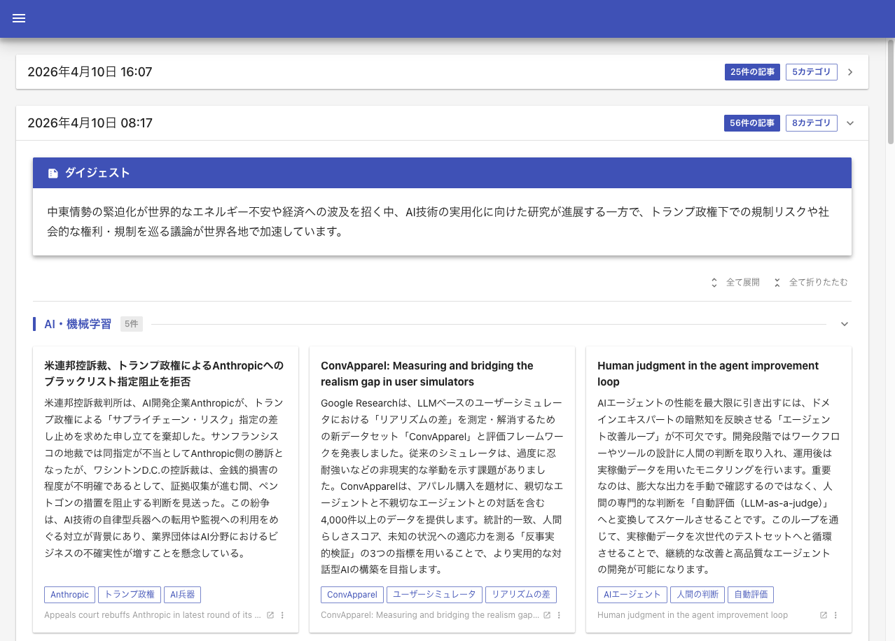

# News Viewer

AI が収集・要約したニュース記事を閲覧するための Web アプリケーション。
バッチごとに蓄積されたニュース要約を、カテゴリ別カード一覧とダイジェストとして表示します。



## 技術スタック

- **フレームワーク**: Next.js 16 (App Router, Standalone output)
- **UI**: MUI v9 (Material Design) + Emotion
- **DB**: Google Cloud Firestore（サーバー側SDK）
- **言語**: TypeScript 5 / React 19
- **コンテナ**: Docker / docker-compose

## セットアップ

### 前提条件

- Node.js 22+
- Google Cloud SDK（実環境のFirestoreを使う場合）

### ローカル開発

```bash
# 依存パッケージをインストール
npm install

# 環境変数を設定
cp .env.local.example .env.local

# 別ターミナルでFirestoreエミュレーターを起動
docker compose up firestore

# 開発サーバーを起動
npm run dev
```

http://localhost:3000 でアクセスできます。実際のFirestoreへ接続する場合は
`GOOGLE_CLOUD_PROJECT`を設定し、`gcloud auth application-default login`を実行してください。

### Docker

```bash
docker compose up --build
```

Viewerは http://localhost:3080 で起動し、同じCompose内のFirestoreエミュレーターへ接続します。

## Google Cloudへのデプロイ

Cloud Run向けのコンテナは`Dockerfile`、Cloud Build設定は`cloudbuild.yaml`にあります。
Firestore、Cloud Run、IAPを含む環境全体は、News-Summarizerリポジトリの
`infra/`からTerraformで構築します。個人・家族利用を想定し、Cloud Runは最小インスタンス数を0、
最大インスタンス数を1に制限しています。

Cloud RunではApplication Default Credentialsが自動的に使われるため、
サービスアカウント鍵ファイルをコンテナへ入れる必要はありません。

## 免責事項

本プロジェクトは個人の学習および自宅環境での利用を目的としたものです。
ISC ライセンスに基づき「現状のまま」提供され、動作保証やサポートは一切行いません。
利用によるデータの損失等についても責任を負いかねます。

Issue への対応は気まぐれです。

## AI 利用

本プロジェクトには Claude Code 及び Gemini CLI を使用しています。

## ライセンス

本プロジェクトは [ISC](LICENSE) ライセンスの下で公開されています。
利用しているサードパーティ製ライブラリとライセンスの一覧は、[THIRD-PARTY-NOTICES.md](THIRD-PARTY-NOTICES.md) を参照してください。
